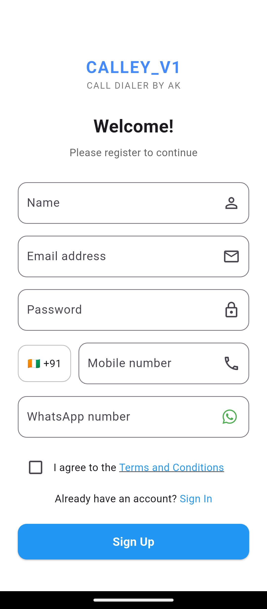
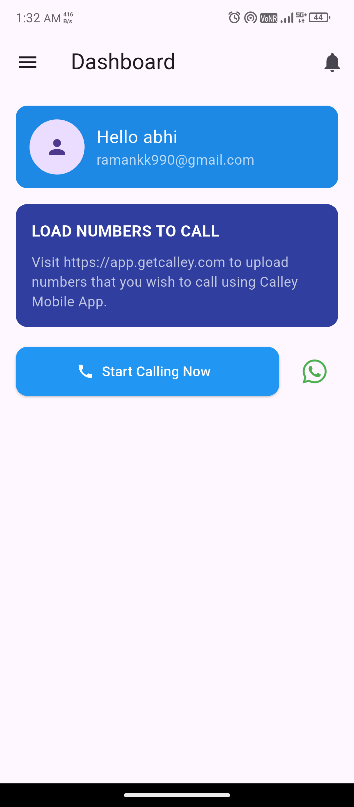
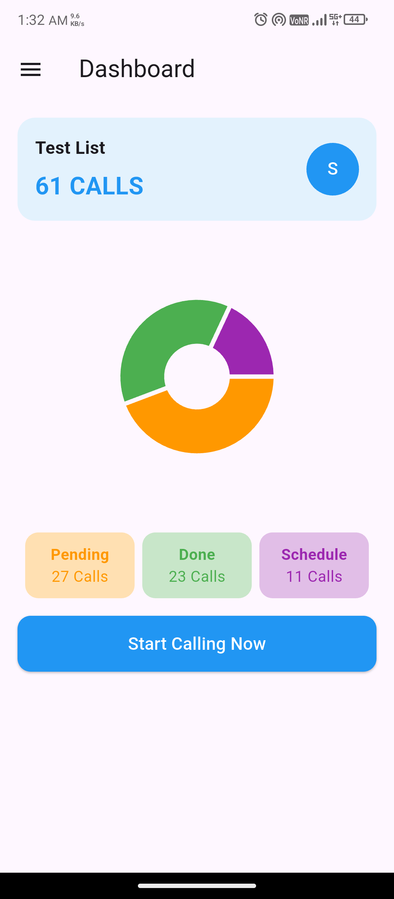
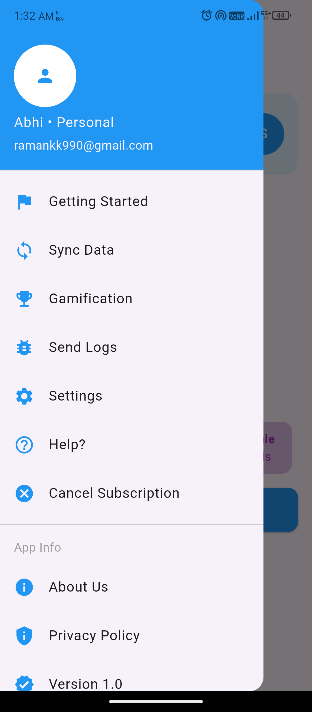

# 📞 Calley_V1
<p align="center"><a href="https://drive.google.com/drive/folders/1FZ8c8lOA9dOfG9HT_IqMDw3yIGJp7ZRn?usp=sharing"></a></p>

A pixel-perfect Flutter app inspired by Calley Mobile App, designed for automated call management and analytics.

---

## 🚀 Features

- 🔐 Email Login & OTP Verification
- 📋 Calling List Selection Before Dashboard
- 📊 Dashboard with:
  - Total Calls
  - Pending / Done / Scheduled
  - Donut Chart Overview
- 📥 Drawer Menu with:
  - Settings
  - App Info
  - Help & Share options
- 🔄 API Integration using `http`
- 💅 Responsive, modern UI with modular structure

---

## 📱 Screenshots:
<table>
    <tr>
        <td><p align= "center"></p></td>
        <td><p align= "center"></p></td>
        <td><p align= "center"></p></td>
        <td><p align= "center"></p></td>
    </tr>
</table>

## 🧱 Folder Structure

```
lib/
├── main.dart
├── screens/
│   ├── login_screen.dart
│   ├── signup_screen.dart
│   ├── otp_verification_screen.dart
│   ├── dashboard_screen.dart
│   ├── main_flow_screen.dart
│   ├── Language_selection_screen.dart
│   

```

---

## 📦 Dependencies

```yaml
dependencies:
  flutter:
    sdk: flutter
  http: ^0.13.6
```

---

## 🔧 Setup & Run

```bash
git clone https://github.com/Abhi999k/Calley_v1.git
cd Calley_v1
flutter pub get
flutter run
```
---

## 📱 Contact me for support:
<div align="center">
  
<a href="https://www.linkedin.com/in/abhishek-kaushik-b677a2260/" target="_blank"></a>
<a href="https://www.x.com/Abhishek_9900" target="_blank"></a>
<a href="mailto:panditak095@gmail.com"></a>
<a href="https://www.facebook.com/Abhishek.Kaushik0" target="_blank"></a>
<a href="https://www.instagram.com/rangbaaz_abhishek__/" target="_blank"></a> 
<a href="https://wa.me/917017212992?text=Hello%2C%20I%20want%20to%20connect%20with%20you!" target="_blank"></a>
<br>
[](https://github.com/Abhi999k/Calley_v1)

[](https://github.com/Abhi999k/Calley_v1)

<br>


